# Post-Exploitation Methodologies

> *The aim of this writeup is to research, experiment, and analyze different types of post exploitation techniques, such as Reflective DLL Injection, the infamous Hell's Gate technique. It goes over how these techniques can be performed on a vulnerable system, how the exploits are structured and implemented, and the ways in which they affect the host system*

##### Prerequisites
1) Obtained Meterpreter session on the Target System
2) Valid .NET Framework Installation
3) Solid understanding of the internal workings of Process Environment Blocks, DLL Structuring, and Windows Thread Functions.

##### Tool List
1) [Reflective DLL Injection Metasploit Module](https://github.com/stephenfewer/ReflectiveDLLInjection/tree/master)
2) [HellsGate](https://github.com/am0nsec/HellsGate / )[SharpHellsGate](https://github.com/am0nsec/SharpHellsGate) (Choose the regular Hell's Gate Implementation instead of the C# one if you are saner than me)
3) [PE to Shellcode](https://github.com/hasherezade/pe_to_shellcode)
4) [Mimikatz](https://github.com/ParrotSec/mimikatz)

## Reflective DLL Injection

Reflective DLL Injection is a advanced post exploitation technique that allows a penetration tester to load a (usually maliciously modified) Dynamic Link Library onto the address space of a process running onto a target system. This is done while loading the DLL from memory, rather than disk, and also without using the traditional `LoadLibrary` or `CreateRemoteThread` functions. Thus, further exploitation can be performed on the target system, while still maintaining a fair amount of stealthiness and avoiding alerting the target.

### Methodology

The way this technique works is by cleverly manipulating the host processes' memory space to spawn new threads in memory in order to achieve a high level of evasion.

The corresponding module parses a maliciously configured DLL file's [Portable Executable](https://tech-zealots.com/malware-analysis/pe-portable-executable-structure-malware-analysis-part-2/) format and identifies the required memory space through the DLL's headers.

Then, that memory is allocated within the host process and the entire DLL's image is loaded onto that address space. Since the data is not loaded by the standard Windows loader, issues may arise. So, the module also handles any manual adjusts of pointers and memory addresses to ensure the DLL works correctly in the hijacked memory space.

Finally, a new process thread is created within the host process that executes the entry point of the loaded DLL, and the code begins to execute. Afterwards, possible cleanups of allocated resources take place.

### Proof of Concept

The most basic form of performing such a technique would be to use the pre-configured `reflective_dll_inject` module of the [Metasploit Framework.](https://www.metasploit.com/)

After performing the initial exploitation steps on the target and obtaining a meterpeter connection on the system, we'll use `ps` to list the current processes running on the target:

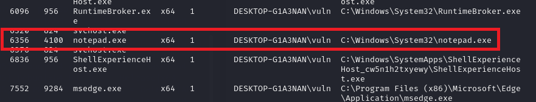

We see that the target has a `Notepad` instance running. We'll take note of the Process ID of `6356`. We'll send the meterpreter shell to the background in order to keep the session alive, and we can then load Metasploit's Reflective DLL module and start configuring it.

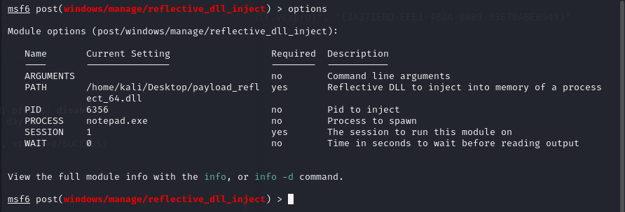

`SESSION` indicates the Session to be used to perform the injection, in our case the open Meterpreter session `1`.

We'll try to hijack the aforementioned Notepad process with a PID of `6356`.

Finally, the payload. For the sake of this assignment, the pre-compiled binary of [Reflective DLL Injection](https://github.com/stephenfewer/ReflectiveDLLInjection/blob/master/bin/reflective_dll.x64.dll) was used, although we'll touch on the modularity and custom payload development options later on.

We can then launch the exploit:

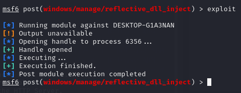

If we take a look at the target machine's screen, we can see that a new text box has appeared, hinting that our exploit was deemed successful.

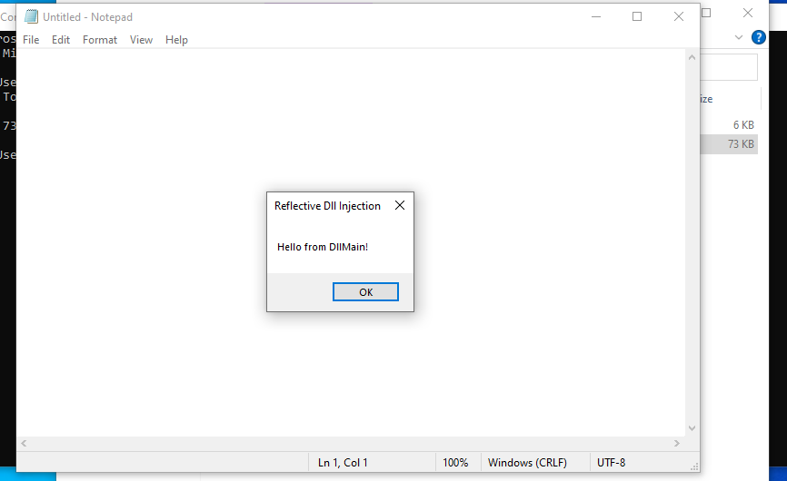

If we observe the process history of the target with a tool like [ProcMon](https://learn.microsoft.com/en-us/sysinternals/downloads/procmon) we can clearly see that after the DLL was loaded onto the host process, it successfully created a new thread with an ID of `5836` that executes the provided commands. In this case, the code required for the alert to pop up.

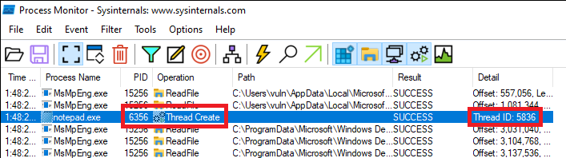

## Hell's Gate

Hell's Gate VX is an advanced method of bypassing security mechanisms that essentially accomplishes execution of malicious code by abusing Windows WoW64's layer, while also straying away from the excessive and implicit invoking of [syscalls](https://www.geeksforgeeks.org/introduction-of-system-call/) that tend to set off alarms in most antiviruses.

The exact workings of this technique, much more its programmatic implementation, are quite complex and as such will not be covered on this document. However, the approach of the method will be discussed to the degree required by our needs, those being the documentation and comparison of methodologies.

The technique primarily makes uses of the `NT WoW64Call` function of Windows that allows 32 bit PE's to be translated onto 64 bit processes. Implementations of Hell's Gate translate Hex code to 32-bit instructions, and then correctly configure the appropriate function parameters of WoW64 to allow the transfer of control to the 32 bit context while still maintaining the execution flow of the 64 bit process.

### Proof of Concept

For the sake of this technique (and its over-the-top name), we'll raise the bar a bit and try to execute a malicious payload this time instead of a simple popup. A common post-exploitation action that is of great significance to a penetration tester is trying to maintain persistence. This can be achieved in many ways, but one of the most effective ones is through dumping of credentials, commonly through the performance of Pass-The-Hash or Pass-The-Ticket attacks. [Mimikatz](https://www.varonis.com/blog/what-is-mimikatz) is a simple tool that can help us achieve that.

Firstly, we'll start by downloading the tool's source code and using a program like [PE2SHC](https://github.com/hasherezade/pe_to_shellcode) to convert the code of Mimikatz from an `exe` into shellcode.

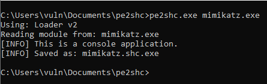

After that, we'll use Kali's integrated `xxd` command to convert the generated shell code onto Hexadecimal format. This ultimately makes it easier for Hell's Gate to process into 32 bit architecture instructions:

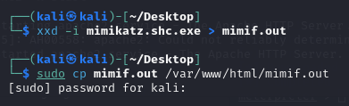

Now, the Hex converted shellcode's raw data should look like this:

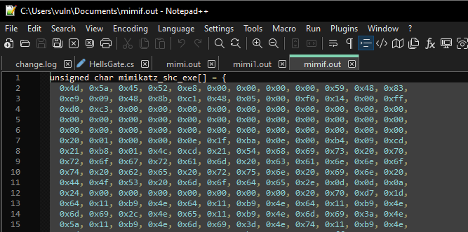

If we now open up the source code of Hell's Gate, we can clearly identify the part in which the program loads the code for injection:

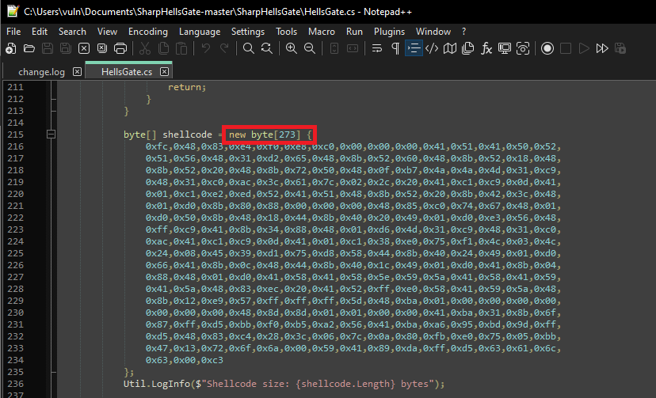

Note the `new byte[273]` command which allocates the array's memory. We'll erase that and replace the payload's code with the Hex code that corresponds to Mimikatz's shell code file:

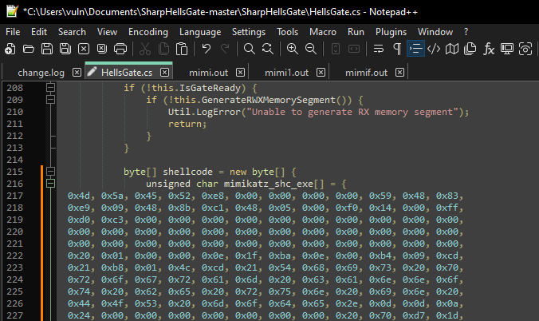

After adjusting some settings, like setting the output to the `.exe` format and selecting the appropriate .NET version required, we can compile the code:

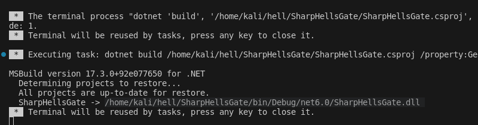

Now we can inject the generated payload into the target system and if everything went correctly, the shell spawned should run a new instance of Mimikatz:

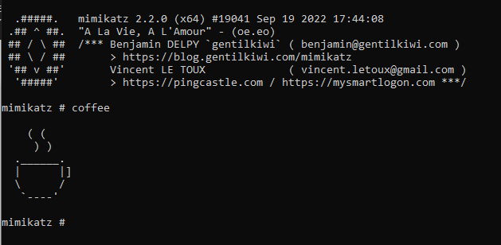

From now on, we can choose our preferred method of dumping hashes or user credentials, and return them to our machine through meterpreter's shell.

> Of course, the above followed procedure is not definitive, and serves merely as a showcase of a typical action chain one should take when approaching a task like this. Payloads and scripts can be used interchangeably within tools like Hell's Gate, different DLL Injection modules can be converted to shell code, and so on. 

#### Sources / Further Reading

[Analyzing Portable Executables](https://www.hackercoolmagazine.com/analysis-of-portable-executable-files-with-peframe/) | [Reflective DLL Injection in C++](https://depthsecurity.com/blog/reflective-dll-injection-in-c) | [Reflective DLL Injection](https://unprotect.it/technique/reflective-dll-injection/) | [Reflected DLL Injection](https://www.exploit-db.com/docs/english/13007-reflective-dll-injection.pdf)
[Evading Defender Using DLL Loading](https://capturethetalent.co.uk/evading-defender-using-reflective-dll-loading/) | [Reflective Code Loading](https://attack.mitre.org/techniques/T1620/) | [Reflective DLL Injection Detection Writeup](https://www.hackthebox.com/blog/reflection-ca-ctf-2022-forensics-writeup) | [DLL Hijacking](https://book.hacktricks.xyz/windows-hardening/windows-local-privilege-escalation/dll-hijacking)

[Hell's Gate](https://vxug.fakedoma.in/papers/VXUG/Exclusive/HellsGate.pdf) | [Syscall Shellcode in WoW64 Windows](https://media.defcon.org/DEF%20CON%2030/DEF%20CON%2030%20presentations/Tarek%20Abdelmotaleb%20%20%20Dr.%20Bramwell%20Brizendine%20-%20Weaponizing%20Windows%20Syscalls%20as%20Modern%2032-bit%20Shellcode%20-%20paper.pdf) | [Bypassing Antivirus Userland Hooks with Direct System Calls in x64 Bit](https://0x00sec.org/t/bypassing-antivirus-userland-hooks-with-direct-system-calls-in-x64-bit-with-syswow64/27998)  | [Backdooring PE Files on Windows](https://resources.infosecinstitute.com/topics/hacking/back-dooring-pe-files-windows/) | [Windows Syscalls in Shellcode: Advanced Techniques for Malicious Functionality](https://conference.hitb.org/hitbsecconf2023ams/materials/D1T2%20-%20Windows%20Syscalls%20in%20Shellcode%20-%20Advanced%20Techniques%20for%20Malicious%20Functionality%20-%20Bramwell%20Brizendine.pdf)  | [Through the Heaven's Gate](https://mark.rxmsolutions.com/through-the-heavens-gate/)  | [Rebuild the Heaven's Gate](https://speakerdeck.com/aaaddress1/rebuild-the-heavens-gate-from-32-bit-hell-back-to-heaven-wonderland)
